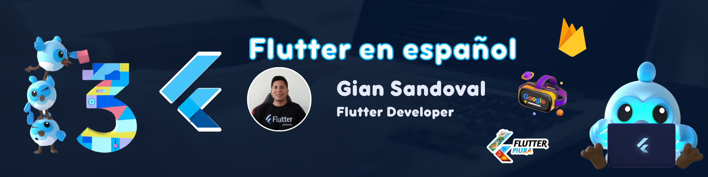

  

<h1 align="center">
  
</h1>

  
  

<h3 align="center">🚀 Desarrollador Senior Flutter | Backend & Frontend | Mentor | Speaker</h3>

  
  
  
  

  
<b>👨🏻‍💻 Sobre mí</b>

  

    <b>Gian Sandoval</b> (<i>Giancarlos Enrique Sandoval Tume</i>) es un <b>ingeniero de sistemas</b> y <b>Flutter Developer Senior</b> peruano, con experiencia desde 2019 en desarrollo de apps multiplataforma (Android, iOS, web).  
    <b>Fundador y líder de Flutter Piura</b>, comunidad activa en Piura (Perú) dedicada a la promoción y enseñanza de Flutter, creada el <b>20 de febrero de 2024</b> y reconocida oficialmente por Google el <b>26 de noviembre de 2024</b>.  
    Instructor y speaker en Flutter, ofreciendo charlas, talleres y cursos web (por ejemplo, webinar gratuito para principiantes en marzo).  
    <b>Experto en Firebase</b>, con experiencia en integraciones en tiempo real y conferencias técnicas.  
    Actualmente, programador analista en la <b>Cooperativa de Ahorro y Créditos Santa Isabel</b>, Piura.  
    En redes sociales se presenta como: 
    <i>Flutter Developer Senior || Líder de Flutter Piura || Speaker || Instructor Flutter || Firebase Expert</i>
  

  
<b>🏆 Logros y Reconocimientos</b>

  <ul>
    <li>� +20 apps publicadas en tiendas (Android/iOS/Web)</li>
    <li>🎤 Speaker en eventos y webinars de tecnología</li>
    <li>🌎 Mentor de estudiantes y desarrolladores Flutter</li>
    <li>🏅 Fundador y líder de Flutter Piura, comunidad reconocida por Google</li>
    <li>🔥 Conferencista sobre Firebase e integraciones en tiempo real</li>
    <li>🏢 Programador analista en Cooperativa Santa Isabel</li>
  </ul>

<!--Skill And More Information-->

  
  

<h2 align="center">🌐 Conecta conmigo</h2>

  
  
  
  
  
  

<h2 align="center">⚡ Tecnologías y Herramientas</h2>

  
  
  
  
  
  
  
  
  
  
  

<h2 align="center">💻 Lenguajes & Frameworks</h2>

  
  
  
  
  
  
  
  
  
  

<i><b>Note:</b> Para más información sobre mi experiencia puedes contactarme en cualquiera de mis redes.</i>

