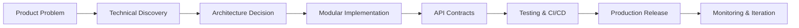

<p align="center">
  
</p>

<p align="center">
  <a href="https://git.io/typing-svg">
    
  </a>
</p>

<p align="center">
  <a href="https://giansandoval.com"></a>
  <a href="https://linkedin.com/in/giansandoval"></a>
  <a href="mailto:giansando2022@gmail.com"></a>
  <a href="https://github.com/GianSandoval5?tab=followers"></a>
</p>

---

## 👋 About me

I am **Giancarlos Sandoval**, a **Software Architect & Mobile Tech Lead** from Piura, Peru, focused on building **scalable mobile and full stack solutions** for banking, fintech, tourism, healthcare, transportation and enterprise platforms.

I specialize in **Flutter, React Native, Clean Architecture, microapps, modular systems, real-time mobile services, Firebase, Node.js, CI/CD and reusable developer tools**.

I enjoy transforming complex product requirements into maintainable architectures, reusable packages and production-ready mobile experiences.

```txt
Software Architecture  ──►  scalable foundations
Mobile Engineering     ──►  Flutter · React Native · Native integrations
Enterprise Frontend    ──►  API contracts · error handling · design systems
Cloud & Realtime       ──►  Firebase · Firestore · Functions · Node.js
Engineering Quality    ──►  testing · CI/CD · releases · code review
Open Source            ──►  packages · libraries · documentation · tooling
```

---

## 🚀 Current focus

- 🏦 Leading frontend mobile initiatives for **enterprise banking environments**.
- 🧱 Designing **mobile architectures** based on Clean Architecture, modularization and microapps.
- 📦 Building **Flutter packages** and **React Native libraries** focused on productivity, UI and reusable systems.
- 🧪 Improving delivery quality through **testing, CI/CD, code review and release management**.
- 🌎 Growing developer communities through **Flutter Piura** and cloud/mobile learning initiatives.

---

## 🧠 Architecture mindset


```mermaid
flowchart LR
    A[Product Problem] --> B[Technical Discovery]
    B --> C[Architecture Decision]
    C --> D[Modular Implementation]
    D --> E[API Contracts]
    E --> F[Testing & CI/CD]
    F --> G[Production Release]
    G --> H[Monitoring & Iteration]
```

I believe strong mobile architecture is not about adding complexity.  
It is about creating clear boundaries, reusable components and predictable delivery.

---

## 🛠️ Tech stack

<p align="center">
  
</p>

### Core expertise

| Area | Technologies & Practices |
|---|---|
| **Mobile Architecture** | Flutter, Dart, React Native, Clean Architecture, Modular Architecture, Microapps, SOLID |
| **Frontend Engineering** | React, Next.js, TypeScript, JavaScript, Component Architecture, Design Systems |
| **Backend & Cloud** | Node.js, Firebase, Firestore, Firebase Functions, REST APIs, Laravel/PHP, Java, Spring Boot |
| **Databases** | MySQL, MariaDB, PostgreSQL, Redis, Firestore, Realtime Database |
| **Quality & DevOps** | Git, GitHub, CI/CD, Unit Testing, TDD, Code Review, Release Management |
| **Open Source** | Flutter Packages, React Native Libraries, SDK Design, Technical Documentation, Semantic Versioning |

---

## 📦 Open Source & Libraries

I build packages and libraries that help mobile teams move faster with better architecture and reusable components.

### Flutter packages

| Package | Focus |
|---|---|
| [`screaming_architecture`](https://pub.dev/packages/screaming_architecture) | Feature-first architecture generator based on modular/domain organization |
| [`modal_date_picker`](https://pub.dev/packages/modal_date_picker) | Advanced cross-platform date picker for Flutter |
| [`share_image_whatsapp`](https://pub.dev/packages/share_image_whatsapp) | Plugin for sharing text, images and QR codes to WhatsApp |
| [`flutter_animated_bubble_background`](https://pub.dev/packages/flutter_animated_bubble_background) | Reusable animated background component for Flutter UIs |

### React Native libraries

| Library | Focus |
|---|---|
| [`react-native-custom-keyboard-pro`](https://www.npmjs.com/package/react-native-custom-keyboard-pro) | Customizable keyboard with layouts, animations and mobile UX focus |
| [`react-native-sliver`](https://www.npmjs.com/package/react-native-sliver) | Advanced scroll composition inspired by Flutter Slivers for React Native |

---

## 🧩 Featured engineering themes

### 🏗️ Enterprise Mobile Architecture
I design scalable foundations for mobile apps that need to grow beyond the first MVP: routing, data layers, error handling, state management, feature modules, API contracts and release workflows.

### 🔁 Reusable Mobile Systems
I create packages, libraries, UI components, design systems and internal APIs that reduce duplication and improve consistency across teams.

### ⚡ Realtime Experiences
I build mobile solutions with realtime synchronization, geolocation, notifications, background services and cloud integrations using Firebase, Firestore, Google Maps and Node.js.

### 🧪 Engineering Quality
I care about maintainability, tests, code review, CI/CD, technical documentation and clean boundaries between presentation, domain and data layers.

---

## 🧭 Open Source roadmap

These are the kinds of projects I am building and improving around my engineering focus:

| Project idea | Why it matters |
|---|---|
| [`flutter_enterprise_architecture`](https://github.com/GianSandoval5/flutter_enterprise_architecture) | Production-ready Flutter starter with Clean Architecture, testing and CI/CD |
| [`react-native-enterprise-starter`](https://github.com/GianSandoval5/react-native-enterprise-starter) | Enterprise React Native foundation with TypeScript, API contracts and reusable components |
| [`mobile_microapps_architecture`](https://github.com/GianSandoval5/mobile_microapps_architecture) | Reference architecture for large-scale mobile apps using independent modules |
| [`mobile_api_contract_validator`](https://github.com/GianSandoval5/mobile_api_contract_validator) | CLI tool to detect breaking changes between backend APIs and mobile clients |
| [`flutter_firebase_mobility_kit`](https://github.com/GianSandoval5/flutter_firebase_mobility_kit) | Realtime mobility starter with Firebase, Maps, tracking and background services |
| [`flutter_banking_architecture_kit`](https://github.com/GianSandoval5/flutter_banking_architecture_kit) | Banking-ready Flutter architecture kit with secure flows, modular features and enterprise delivery patterns |

---

## 🌎 Community & leadership

- Founder & Lead Organizer at **Flutter Piura**.
- Mobile & Full Stack instructor focused on real-world projects, architecture and employability.
- AWS User Group Leader for **AWS Piura**.
- Advocate for technical communities, workshops, mentoring and practical engineering education.

---

## 📊 GitHub analytics

<p align="center">
  
  
</p>

<p align="center">
  
</p>

<p align="center">
  
</p>

---

## 🤝 Let's connect

I am open to collaborating on **mobile architecture, Flutter, React Native, Firebase, developer tools, open source packages and technical communities**.

<p align="center">
  <a href="https://linkedin.com/in/giansandoval"></a>
  <a href="mailto:giansando2022@gmail.com"></a>
  <a href="https://giansandoval.com"></a>
</p>

<p align="center">
  
</p>
